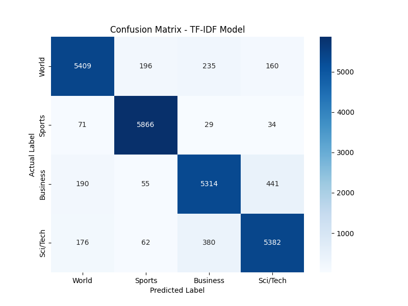

### جدول نتایج

| Method | Accuracy | Precision | Recall | Macro-F1 |
|:---|---:|---:|---:|---:|
| TF-IDF (Baseline) | 0.9155 | 0.9152 | 0.9155 | 0.9153 |
| Your Word2Vec | 0.8103 | 0.8098 | 0.8103 | 0.8100 |
| Pre-trained GloVe | 0.8889 | 0.8886 | 0.8889 | 0.8887 |

### تحلیل نتایج

1.  **برتری TF-IDF:** مدل TF-IDF با دقت **91.55%** بهترین عملکرد را داشت. دلیل این برتری این است که در تسک طبقه‌بندی موضوعی، شناسایی کلمات کلیدی خاص (که TF-IDF در آن تخصص دارد) مؤثرتر از درک معنایی کلی جمله (که با میانگین‌گیری embeddingها به دست می‌آید) است.

2.  **عملکرد Embeddingها:** مدل GloVe (با دقت 88.89%) به دلیل آموزش روی داده‌های بسیار بزرگتر، از مدل Word2Vec ما (با دقت 81.03%) بهتر عمل کرد.

### تحلیل ماتریس درهم‌ریختگی (Confusion Matrix)

*   **تشخیص صحیح:** مدل در تشخیص دسته **Sports** بسیار موفق بود، زیرا این دسته واژگان منحصر به فردی دارد.
*   **خطاهای اصلی:** بیشترین خطاها بین دسته‌هایی با موضوعات مشترک رخ داد:
    *   **Business و Sci/Tech:** به دلیل ماهیت تجاری اخبار فناوری.
    *   **World و Business:** به دلیل پرداختن به اقتصاد جهانی.

### نتیجه‌گیری

برای تسک طبقه‌بندی موضوعی، روش کلاسیک **TF-IDF** به دلیل تمرکز بر کلمات کلیدی، همچنان یک معیار بسیار قوی و مؤثر است و از روش میانگین‌گیری Word Embeddingها عملکرد بهتری ارائه داد.